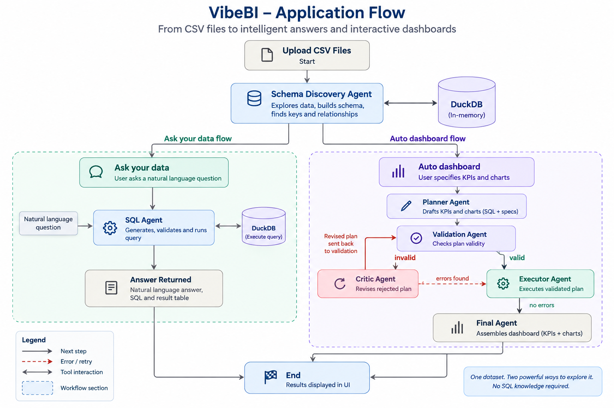

# VibeBI — Multi-Agent Business Intelligence & Dashboard Engine
[](LICENSE)


> **A multi-agent AI Business Intelligence system that transforms uploaded CSV files into schema-aware SQL analysis and automatically generated interactive dashboards.**

From raw CSV files to validated SQL, KPIs, charts, and natural-language insights through an agentic workflow.

---

## 📋 Table of Contents

- [Overview](#-overview)
- [Problem Statement](#-problem-statement)
- [Solution](#-solution)
- [Why Agents Are Necessary](#-why-agents-are-necessary)
- [How It Works](#-how-it-works)
- [Key Features](#-key-features)
- [Architecture](#-architecture)
- [Agent Specifications](#-agent-specifications)
- [Tech Stack](#-tech-stack)
- [Installation](#-installation)
- [Usage](#-usage)
- [Example Workflows](#-example-workflows)
- [Project Structure](#-project-structure)
- [AI Engineering Concepts Demonstrated](#-ai-engineering-concepts-demonstrated)
- [Future Improvements](#-future-improvements)
- [Contributing](#-contributing)
- [License](#-license)
- [Acknowledgments](#-acknowledgments)

---

## 🎯 Overview

**VibeBI** is a multi-agent Business Intelligence application designed to make structured data analysis accessible through natural language.

Users upload one or more CSV files, and VibeBI automatically:

1. Loads the data into DuckDB.
2. Discovers tables, columns, candidate keys, and relationships.
3. Builds a structured schema representation.
4. Answers analytical questions using generated SQL.
5. Plans KPI cards and visualizations from natural-language dashboard requests.
6. Validates generated SQL before execution.
7. Executes validated dashboard elements.
8. Sends failed plans to a Critic Agent for repair.
9. Produces an interactive Gradio dashboard with Plotly charts.
10. Supports printing/export of dashboard and query results.

The project demonstrates how **LLM reasoning can be combined with deterministic database validation** to create more reliable AI-powered analytics.

### Quick Stats

- **Specialized Agents:** 7
- **Main Workflows:** 3
- **Database Engine:** DuckDB
- **Dashboard Engine:** Plotly
- **Frontend:** Gradio
- **Orchestration:** LangGraph
- **LLM Backend:** Hugging Face inference through an OpenAI-compatible endpoint
- **CSV Upload Support:** Up to 10 files by default
- **Dashboard Capacity:** Up to 6 KPIs + 6 charts by default
- **Automatic Repair:** Up to 2 dashboard revisions by default
- **Database Server Required:** No

---

## 🚨 Problem Statement

Building a dashboard from unfamiliar CSV files usually requires several manual steps:

| Challenge | Traditional BI Workflow |
|---|---|
| **Unknown Schema** | Manually inspect every table and column |
| **Table Relationships** | Identify primary and foreign keys manually |
| **SQL Knowledge** | User must know how to write joins and aggregations |
| **Dashboard Design** | Analyst manually selects KPIs and visualizations |
| **SQL Errors** | Queries often need repeated debugging |
| **Changing Datasets** | Logic may be hard-coded to one schema |
| **LLM Hallucination Risk** | AI can invent tables, columns, or unsupported metrics |
| **Visualization Errors** | SQL output may not match chart configuration |

A simple chatbot is not enough.

The system needs to understand the uploaded schema, generate SQL, verify that SQL against the real database, execute it, detect errors, repair failures, and present the result visually.

---

## 💡 Solution

VibeBI uses a **multi-agent architecture** where each agent has a specific responsibility.

Instead of asking one LLM to understand the database, generate SQL, validate it, build charts, fix mistakes, and summarize everything in a single step, VibeBI separates those responsibilities.

This produces a workflow that is easier to inspect, debug, and extend.

### Why Agents Are Necessary

VibeBI uses agentic AI rather than a single prompt because dashboard generation requires multiple reasoning and validation stages.

- ✅ **Schema Awareness:** The system first discovers what data actually exists.
- ✅ **Tool Calling:** Agents use DuckDB-backed Python tools instead of relying only on generated text.
- ✅ **Dynamic Routing:** LangGraph routes execution based on validation and execution outcomes.
- ✅ **Self-Correction:** Failed dashboard plans are sent to a Critic Agent.
- ✅ **Deterministic Validation:** DuckDB verifies generated SQL before dashboard execution.
- ✅ **Task Specialization:** Different agents handle schema discovery, SQL generation, dashboard planning, validation, execution, critique, and final reporting.
- ✅ **Schema Grounding:** SQL and dashboard metrics must use the real uploaded tables and columns.
- ✅ **Safe Execution:** Only read-only analytical SQL is allowed.

---

## 🔄 How It Works


---

## ✨ Key Features

### 🤖 Multi-Agent Orchestration

VibeBI contains seven specialized agents:

- **Schema Discovery Agent**
- **SQL Agent**
- **Dashboard Planner Agent**
- **Dashboard Validation Agent**
- **Dashboard Executor Agent**
- **Dashboard Critic Agent**
- **Dashboard Final Agent**

LangGraph controls how these agents are connected and determines where execution goes next.

---

### 🧠 Automatic Schema Discovery

The Schema Discovery Agent analyzes uploaded CSV files before any analytical query is created.

It can inspect:

- table names
- column names
- DuckDB data types
- row counts
- null/missing values
- distinct values
- uniqueness
- cardinality
- sample values
- candidate primary keys
- composite primary keys
- candidate foreign keys
- value inclusion between columns
- possible `1:1`, `1:N`, and `N:M` relationships
- semantic column roles

This makes the application dynamic across different CSV datasets.

---

### 💬 Ask Your Data

Users can ask analytical questions without writing SQL.

Example:

```text
Which product category generated the highest total revenue?
```

The SQL Agent:

1. Reads the discovered schema.
2. Selects the required tables and columns.
3. Uses verified relationships when joins are necessary.
4. Generates DuckDB-compatible SQL.
5. Calls the SQL execution tool.
6. Receives the real query result.
7. Summarizes the result in natural language.

The interface displays:

- answer
- generated SQL
- result table

This branch intentionally focuses on data analysis rather than visualization.

---

### 📊 Automatic Dashboard Generation

Users can describe the dashboard they want in plain English.

Example:

```text
Build a dashboard with 4 KPIs for the most important business metrics
and 4 charts showing trends, category performance, and regional results.
```

The Dashboard Planner creates:

- dashboard title
- KPI definitions
- KPI SQL
- chart definitions
- chart SQL
- x-axis fields
- y-axis fields
- optional color/grouping fields
- chart titles
- readable axis labels

Supported visualization types include:

- bar
- line
- scatter
- pie
- area
- histogram
- box
- choropleth

---

### ✅ Deterministic Dashboard Validation

One of VibeBI's most important design decisions is separating **generation** from **validation**.

The LLM proposes the dashboard.

DuckDB checks whether the proposal is actually executable.

The validator verifies:

- SQL is read-only
- referenced tables exist
- referenced columns exist
- joins can be bound
- SQL expressions are valid
- KPI queries produce usable outputs
- chart queries expose the aliases required by the visualization
- x/y/color fields exist in the returned data

This prevents the executor from blindly trusting generated SQL.

---

### 🔁 Critic & Self-Correction Loop

If validation or execution fails, the workflow does not immediately stop.

The Dashboard Critic Agent receives:

- the dashboard plan
- validation problems
- execution errors
- schema context

It then repairs only what is necessary.

Typical corrections include:

- invalid table references
- invalid column names
- incorrect aliases
- unsupported aggregations
- invalid joins
- chart fields that do not exist in SQL output

The corrected plan is routed back through validation before execution.

---

### 🔐 SQL Safety

VibeBI restricts database execution to analytical read-only queries.

Allowed query forms:

```sql
SELECT ...
```

```sql
WITH ...
SELECT ...
```

Potentially destructive operations are rejected, including:

```text
INSERT
UPDATE
DELETE
DROP
ALTER
CREATE
TRUNCATE
COPY
ATTACH
DETACH
INSTALL
LOAD
PRAGMA
CALL
```

This creates a safer environment for LLM-generated SQL.

---

### 🎨 Interactive Visualization

Dashboard results are rendered using Plotly and displayed inside Gradio.

Users can work with:

- KPI cards
- interactive charts
- dashboard titles
- chart titles
- axis labels
- chart editing controls
- generated dashboard plan
- print / PDF output


---

## 🏗️ Architecture

### High-Level System Diagram

```text
┌──────────────────────────────────────────────┐
│              USER INTERFACE                 │
│                  Gradio                      │
│ Upload CSV | Ask Data | Auto Dashboard       │
└──────────────────────┬───────────────────────┘
                       ↓
┌──────────────────────────────────────────────┐
│           ORCHESTRATION LAYER                │
│                 LangGraph                     │
│ Schema | SQL | Dashboard workflows            │
└──────────────────────┬───────────────────────┘
                       ↓
┌──────────────────────────────────────────────┐
│                AGENT LAYER                   │
│ Schema Agent | SQL Agent | Planner           │
│ Validation | Executor | Critic | Final       │
└──────────────────────┬───────────────────────┘
                       ↓
┌──────────────────────────────────────────────┐
│              TOOL LAYER                      │
│ Schema tools | SQL tools | Dashboard tools   │
└──────────────────────┬───────────────────────┘
                       ↓
┌──────────────────────────────────────────────┐
│          DATA & EXECUTION LAYER              │
│              DuckDB + Pandas                 │
└──────────────────────┬───────────────────────┘
                       ↓
┌──────────────────────────────────────────────┐
│          VISUALIZATION & OUTPUT              │
│              Plotly + Gradio                 │
│ KPIs | Charts | Tables | PDF                 │
└──────────────────────────────────────────────┘
```


## 🛠️ Tech Stack

| Component | Technology | Purpose |
|---|---|---|
| **Language** | Python 3.11 | Application runtime |
| **Agent Orchestration** | LangGraph | Multi-agent workflow and conditional routing |
| **Agent Messaging / Tools** | LangChain Core | Tool binding and message abstractions |
| **LLM Backend** | Hugging Face Inference Router | Agent reasoning and generation |
| **LLM Client** | `langchain-openai` | OpenAI-compatible connection to HF endpoint |
| **Analytical Database** | DuckDB | CSV ingestion, SQL execution, validation |
| **Tabular Processing** | Pandas | Query results and dataframe operations |
| **Visualization** | Plotly | Interactive charts |
| **Frontend** | Gradio | Application UI |
| **Configuration** | python-dotenv | Environment variables |

### Infrastructure Requirements

VibeBI does **not** require:

- PostgreSQL
- MySQL
- Neo4j
- Redis
- a separate vector database
- a standalone database server

DuckDB runs locally inside the application.

---

## 📦 Installation

### Prerequisites

- Python 3.11+
- pip
- Hugging Face API token

### 1. Clone Repository

```bash
git clone https://github.com/YOUR_USERNAME/VibeBI.git
cd VibeBI
```

### 2. Create Virtual Environment

```bash
python3 -m venv .venv
source .venv/bin/activate
```

Windows:

```bash
.venv\Scripts\activate
```

### 3. Install Dependencies

```bash
python3 -m pip install --upgrade pip
python3 -m pip install -r requirements.txt
```

### 4. Configure Environment

Copy the template:

```bash
cp .env.example .env
```

Then edit `.env`:

```env
HF_TOKEN=hf_your_huggingface_token_here

HF_MODEL=openai/gpt-oss-120b:fastest
HF_BASE_URL=https://router.huggingface.co/v1

PORT=7860

MAX_CSV_FILES=10
MAX_DASHBOARD_KPIS=6
MAX_DASHBOARD_CHARTS=6
MAX_DASHBOARD_REVISIONS=2
```

> Never commit your real `.env` file or Hugging Face token to GitHub.

### 5. Launch Application

```bash
python3 main.py
```

Open:

```text
http://localhost:7860
```

-

## 📁 Project Structure

```text
VibeBI/
│
├── agent/
│   ├── schema_agent.py
│   ├── sql_agent.py
│   ├── dashboard_planner_agent.py
│   ├── dashboard_validation_agent.py
│   ├── dashboard_executor_agent.py
│   ├── dashboard_critic_agent.py
│   └── dashboard_final_agent.py
│
├── tools/
│   ├── schema_tools.py
│   ├── sql_tools.py
│   ├── dashboard_validation_tools.py
│   └── dashboard_executor_tools.py
│
├── workflow/
│   ├── nodes.py
│   └── edges.py
│
├── app/
│   └── ui.py
│
├── data/
│   └── README.md
│
├── config.py
├── llm.py
├── state.py
├── utils.py
├── main.py
├── requirements.txt
├── .env.example
├── .gitignore
└── README.md
```

---

## 🎓 AI Engineering Concepts Demonstrated

VibeBI demonstrates multiple concepts relevant to modern AI engineering.

| # | Concept | Implementation |
|---|---|---|
| **1** | Multi-Agent Orchestration | Seven specialized agents coordinated through LangGraph |
| **2** | Tool Calling | Agents use DuckDB-backed tools for schema analysis and execution |
| **3** | Text-to-SQL | Natural-language questions are translated into executable SQL |
| **4** | Schema Grounding | Generated SQL is constrained to discovered tables and columns |
| **5** | Deterministic Validation | DuckDB validates AI-generated SQL before execution |
| **6** | Self-Correction | Critic Agent repairs failed dashboard plans |
| **7** | Conditional Routing | LangGraph changes workflow based on success/failure state |
| **8** | Safe AI Execution | SQL is restricted to read-only analytical statements |
| **9** | Dynamic Visualization | SQL outputs are converted into Plotly dashboards |
| **10** | Human-in-the-Loop Editing | Users can modify generated chart titles and labels |

---


---

## 🚀 Future Improvements

### 1. Persistent Projects

Save uploaded datasets, dashboard configurations, and user query history across sessions.

### 2. Richer Data Quality Agent

Add automatic detection of:

- outliers
- duplicate records
- inconsistent categories
- impossible values
- date anomalies
- missing-data patterns

### 3. Query History

Store previous:

- questions
- SQL queries
- results
- dashboards

### 4. Additional Export Formats

Potential exports:

- PDF
- PNG
- HTML
- Excel
- PowerPoint


### 5. Extended Database Support

Future connectors could include:

- PostgreSQL
- MySQL
- Snowflake
- BigQuery
- Databricks

while preserving the same multi-agent workflow.

### 8. Evaluation Framework

Add automated evaluation for:

- SQL correctness
- schema-grounding accuracy
- dashboard success rate
- repair success rate
- query latency
- LLM token usage

---

## 🤝 Contributing

Contributions are welcome.


---
## 📄 License


This project is licensed under the MIT License. See the [LICENSE](LICENSE) file for details.

---

## 🙏 Acknowledgments

Built with:

- **LangGraph** — agent workflow orchestration
- **LangChain** — LLM and tool abstractions
- **Hugging Face** — hosted model inference
- **DuckDB** — embedded analytical database
- **Pandas** — tabular processing
- **Plotly** — interactive visualization
- **Gradio** — web application interface

---

## 🌟 Final Note

VibeBI was built to explore how **agentic AI can improve Business Intelligence workflows without giving the LLM unrestricted control over the data layer**.

The project combines:

- multi-agent AI
- schema discovery
- Text-to-SQL
- deterministic SQL validation
- automatic dashboard generation
- self-correcting workflows
- interactive data visualization

The result is a reusable architecture where users can upload unfamiliar CSV datasets and move from raw data to validated analytical insights through natural language.
